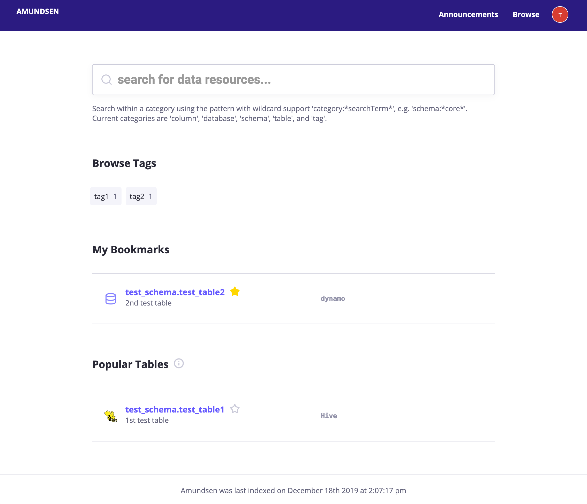

# Amundsen

Amundsen is a metadata driven application for improving the productivity of data analysts, data scientists and engineers when interacting with data. It does that today by indexing data resources (tables, dashboards, streams, etc.) and powering a page-rank style search based on usage patterns (e.g. highly queried tables show up earlier than less queried tables). Think of it as Google search for data. The project is named after Norwegian explorer [Roald Amundsen](https://en.wikipedia.org/wiki/Roald_Amundsen), the first person to discover South Pole.

It includes three microservices and a data ingestion library.
- [amundsenfrontendlibrary](https://github.com/lyft/amundsenfrontendlibrary): Frontend service which is a Flask application with a React frontend.
- [amundsensearchlibrary](https://github.com/lyft/amundsensearchlibrary): Search service, which leverages Elasticsearch for search capabilities, is used to power frontend metadata searching.
- [amundsenmetadatalibrary](https://github.com/lyft/amundsenmetadatalibrary): Metadata service, which leverages Neo4j or Apache Atlas as the persistent layer, to provide various metadata.
- [amundsendatabuilder](https://github.com/lyft/amundsendatabuilder): Data ingestion library for building metadata graph and search index.
Users could either load the data with [a python script](https://github.com/lyft/amundsendatabuilder/blob/master/example/scripts/sample_data_loader.py) with the library
or with an [Airflow DAG](https://github.com/lyft/amundsendatabuilder/blob/master/example/dags/sample_dag.py) importing the library.

## Requirements
- Python >= 3.4
- Node = v8.x.x or v10.x.x (v11.x.x has compatibility issues)
- npm >= 6.x.x

## User Interface

Please note that the mock images only served as demonstration purpose.

- **Landing Page**: The landing page for Amundsen including 1. search bars; 2. popular used tables;

    

- **Table Detail Page**: Visualization of a Hive / Redshift table

    

- **Column detail**: Visualization of columns of a Hive / Redshift table which includes an optional stats display

    

- **Data Preview Page**: Visualization of table data preview which could integrate with [Apache Superset](https://github.com/apache/incubator-superset)

    

## Get Involved in the Community

Want help or want to help?
Use the button in our [header](https://github.com/lyft/amundsen#amundsen) to join our slack channel. Please join our [mailing list](https://groups.google.com/forum/#!forum/amundsen-dev) as well.

## Powered By

Here is the list of organizations that are using Amundsen today. If your organization uses Amundsen, please file a PR and update this list.

Currently **officially** using Amundsen:

1. [Bang & Olufsen](https://www.bang-olufsen.com/en)
1. [Data Sprints](https://datasprints.com/)
1. [Everfi](https://everfi.com/)
1. [ING](https://www.ing.com/Home.htm)
1. [LMC](https://www.lmc.eu/cs/)
1. [Lyft](https://www.lyft.com/)
1. [Square](https://squareup.com/us/en)
1. [Workday](https://www.workday.com/en-us/homepage.html)
1. [Remitly](https://www.remitly.com/)

## Getting Started

Please visit the Amundsen installation documentation for a [quick start](https://github.com/lyft/amundsen/blob/master/docs/installation.md#bootstrap-a-default-version-of-amundsen-using-docker) to bootstrap a default version of Amundsen with dummy data.

## Architecture Overview

Please visit [Architecture](docs/architecture.md) for Amundsen architecture overview.

## Installation

Please visit [Installation guideline](docs/installation.md) on how to install Amundsen.

## Roadmap

Please visit [Roadmap](docs/roadmap.md) if you are interested in Amundsen upcoming roadmap items.

## Blog Posts and Interviews

- [Amundsen - Lyft's data discovery & metadata engine](https://eng.lyft.com/amundsen-lyfts-data-discovery-metadata-engine-62d27254fbb9) (April 2019)
- [Software Engineering Daily podcast on Amundsen](https://softwareengineeringdaily.com/2019/04/16/lyft-data-discovery-with-tao-feng-and-mark-grover/) (April 2019)
- [How Lyft Drives Data Discovery](https://youtu.be/WVjss62XIG0) (July 2019)
- [Data Engineering podcast on Solving Data Discovery At Lyft](https://www.dataengineeringpodcast.com/amundsen-data-discovery-episode-92/) (Aug 2019)

## Talks

- Disrupting Data Discovery {[slides](https://www.slideshare.net/taofung/strata-sf-amundsen-presentation), [video](https://www.youtube.com/watch?v=m1B-ptm0Rrw)} (Strata SF, March 2019)
- Amundsen: A Data Discovery Platform from Lyft {[slides](https://www.slideshare.net/taofung/data-council-sf-amundsen-presentation)} (Data Council SF, April 2019)
- Disrupting Data Discovery {[slides](https://www.slideshare.net/markgrover/disrupting-data-discovery)} (Strata London, May 2019)
- ING Data Analytics Platform (Amundsen is mentioned) {[slides](https://static.sched.com/hosted_files/kccnceu19/65/ING%20Data%20Analytics%20Platform.pdf), [video](https://www.youtube.com/watch?v=8cE9ppbnDPs&t=465) } (Kubecon Barcelona, May 2019)
- Disrupting Data Discovery {[slides](https://www.slideshare.net/PhilippeMizrahi/meetup-sf-amundsen), [video](https://www.youtube.com/watch?v=NgeCOVjSJ7A)} (Making Big Data Easy SF, May 2019)

# License
[Apache 2.0 License.](/LICENSE)
