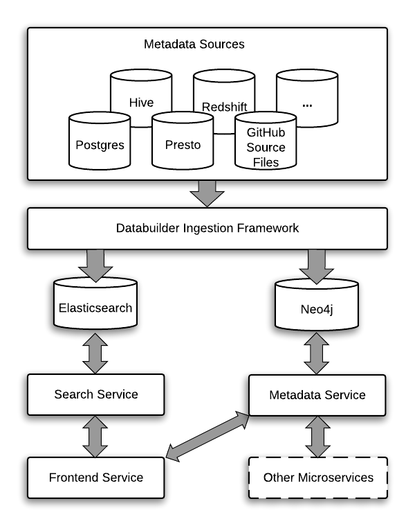
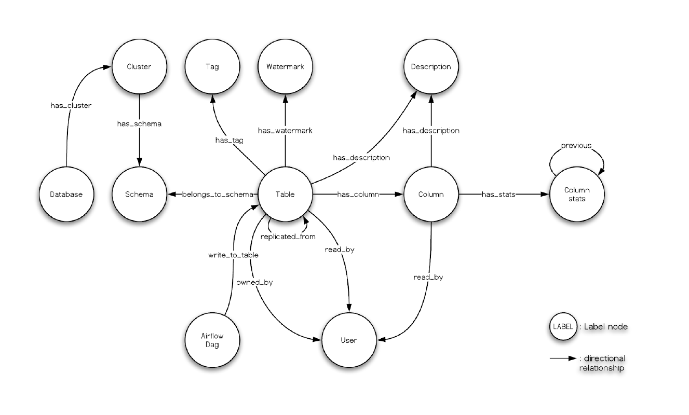

# Architecture

The following diagram shows the overall architecture for Amundsen.

## Frontend

The [frontend service](/frontend#amundsen-frontend-service) serves as web UI portal for users interaction.
It is Flask-based web app which representation layer is built with React with Redux, Bootstrap, Webpack, and Babel.

## Search

The [search service](/search#amundsen-search-service) proxy leverages Elasticsearch's search functionality (or Apache Atlas's search API, if that's the backend you picked) and
provides a RESTful API to serve search requests from the frontend service. This [API is documented and live explorable](/search#api-documentation) through OpenAPI aka "Swagger".
Currently only [table resources](https://github.com/amundsen-io/amundsen/blob/main/databuilder/databuilder/models/elasticsearch_document.py) are indexed and searchable.
The search index is built with the [databuilder elasticsearch publisher](https://github.com/amundsen-io/amundsen/blob/main/databuilder/databuilder/publisher/elasticsearch_publisher.py).

## Metadata

The [metadata service](/metadata#amundsen-metadata-service) currently uses a Neo4j proxy to interact with Neo4j graph db and serves frontend service's metadata.
The metadata is represented as a graph model:

The above diagram shows how metadata is modeled in Amundsen.

## Databuilder

Amundsen provides a [data ingestion library](/databuilder) for building the metadata. At Lyft, we build the metadata once a day
using an Airflow DAG ([examples](/databuilder/example/dags)).

In addition to "real use" the databuilder is also employed as a handy tool to ingest some ["pre-cooked" demo data](/databuilder/example/sample_data/) used in the Quickstart guide. This allows you to have a supersmall sample of data to explore so many of the features in Amundsen are lit up without you even having to setup any connections to databases etc. to ingest real data.
