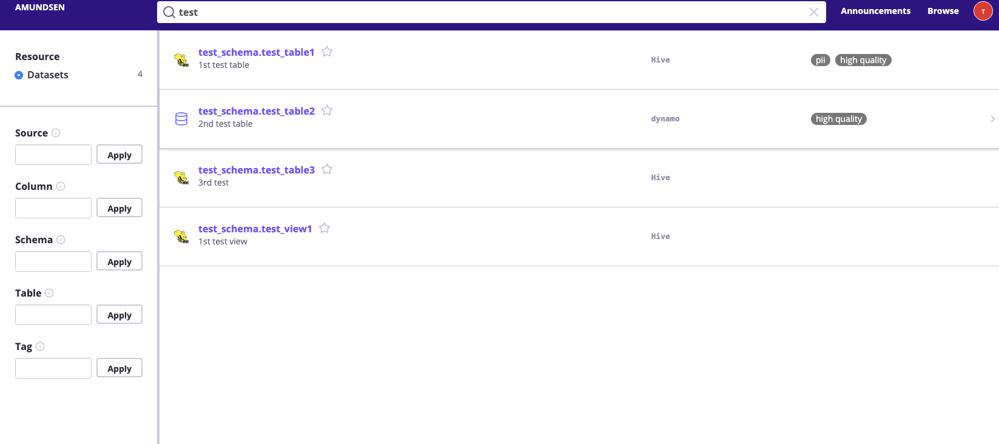
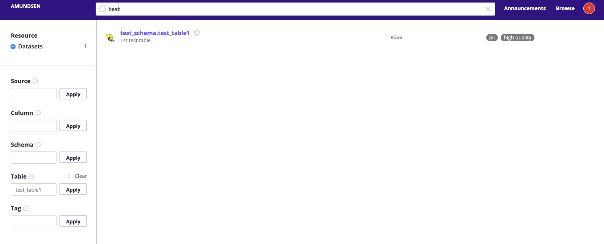
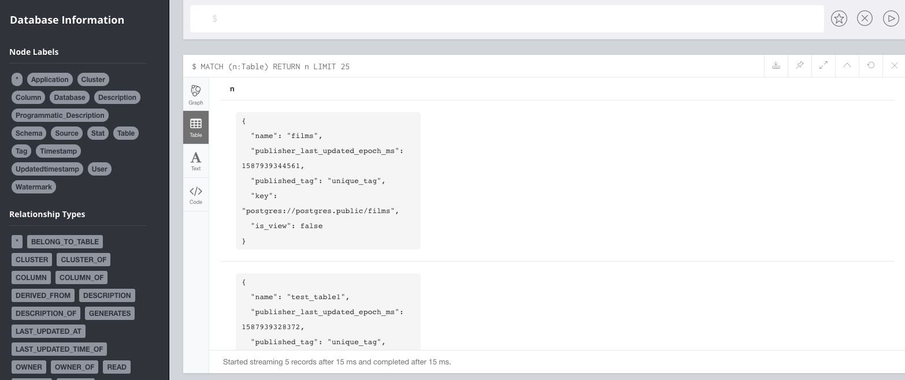
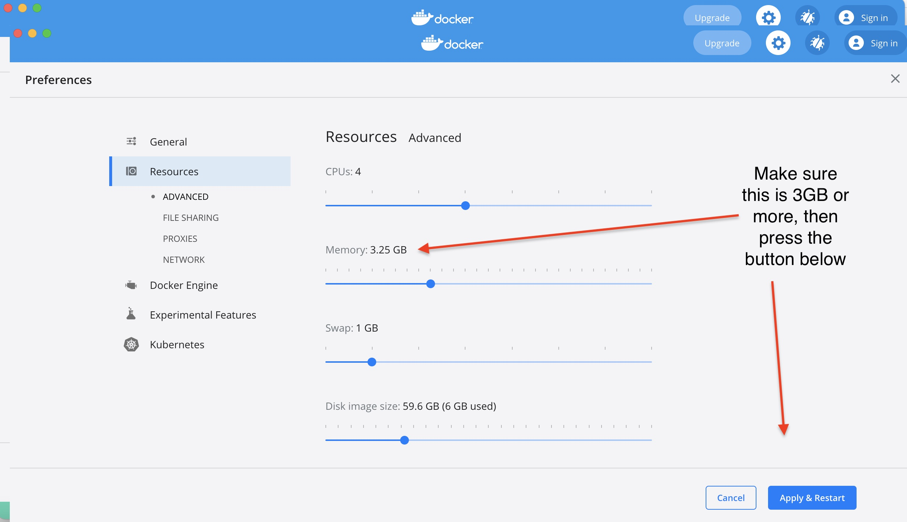

# Installation

## Bootstrap a default version of Amundsen using Docker
The following instructions are for setting up a version of Amundsen using Docker.

1. Make sure you have at least 3GB available to docker. Install `docker` and  `docker-compose`.
2. Clone [this repo](https://github.com/amundsen-io/amundsen) and its submodules by running:
   ```bash
   $ git clone --recursive https://github.com/amundsen-io/amundsen.git
   ```
3. Enter the cloned directory and run below:
    ```bash
    # For Neo4j Backend
    $ docker-compose -f docker-amundsen.yml up

    # For Atlas
    $ docker-compose -f docker-amundsen-atlas.yml up
    ```
    If it's your first time, you may want to proactively go through [troubleshooting](#troubleshooting) steps, especially the first one related to heap memory for ElasticSearch and Docker engine memory allocation (leading to Docker error 137).
4. Ingest provided sample data into Neo4j by doing the following: _(Please skip if you are using Atlas backend)_

   * In a separate terminal window, change directory to [databuilder](https://github.com/amundsen-io/amundsen/tree/main/databuilder).
   * `sample_data_loader` python script included in `examples/` directory uses _elasticsearch client_, _pyhocon_ and other libraries. Install the dependencies in a virtual env and run the script by following the commands below:
   ```bash
    $ python3 -m venv venv
    $ source venv/bin/activate
    $ pip3 install --upgrade pip
    $ pip3 install -r requirements.txt
    $ python3 setup.py install
    $ python3 example/scripts/sample_data_loader.py
   ```
5. View UI at [`http://localhost:5000`](http://localhost:5000) and try to search `test`, it should return some result.


6. We could also do an exact matched search for table entity. For example: search `test_table1` in table field and 
it return the records that matched.


**Atlas Note:** Atlas takes some time to boot properly. So you may not be able to see the results immediately 
after `docker-compose up` command. 
Atlas would be ready once you'll have the following output in the docker output `Amundsen Entity Definitions Created...`  

### Verify setup

1. You can verify dummy data has been ingested into Neo4j by by visiting [`http://localhost:7474/browser/`](http://localhost:7474/browser/) and run `MATCH (n:Table) RETURN n LIMIT 25` in the query box. You should see few tables.

2. You can verify the data has been loaded into the metadataservice by visiting:
   1. [`http://localhost:5000/table_detail/gold/hive/test_schema/test_table1`](http://localhost:5000/table_detail/gold/hive/test_schema/test_table1)
   2. [`http://localhost:5000/table_detail/gold/dynamo/test_schema/test_table2`](http://localhost:5000/table_detail/gold/dynamo/test_schema/test_table2)

### Troubleshooting

1. If the docker container doesn't have enough heap memory for Elastic Search, `es_amundsen` will fail during `docker-compose`.
   1. docker-compose error: `es_amundsen | [1]: max virtual memory areas vm.max_map_count [65530] is too low, increase to at least [262144]`
   2. Increase the heap memory [detailed instructions here](https://www.elastic.co/guide/en/elasticsearch/reference/7.1/docker.html#docker-cli-run-prod-mode)
      1. Edit `/etc/sysctl.conf`
      2. Make entry `vm.max_map_count=262144`. Save and exit.
      3. Reload settings `$ sysctl -p`
      4. Restart `docker-compose`
      
2. If `docker-amundsen-local.yml` stops because of `org.elasticsearch.bootstrap.StartupException: java.lang.IllegalStateException: Failed to create node environment`, then `es_amundsen` [cannot write](https://discuss.elastic.co/t/elastic-elasticsearch-docker-not-assigning-permissions-to-data-directory-on-run/65812/4) to `.local/elasticsearch`. 
   1. `chown -R 1000:1000 .local/elasticsearch`
   2. Restart `docker-compose` 
3. If when running the sample data loader you recieve a connection error related to ElasticSearch or like this for Neo4j:
```
    Traceback (most recent call last):
      File "/home/ubuntu/amundsen/amundsendatabuilder/venv/lib/python3.6/site-packages/neobolt/direct.py", line 831, in _connect
        s.connect(resolved_address)
    ConnectionRefusedError: [Errno 111] Connection refused
```
4. If `elastic search` container stops with an error `max file descriptors [4096] for elasticsearch process is too low, increase to at least [65535]`, then add the below code to the file `docker-amundsen-local.yml` in the `elasticsearch` definition.
```
 ulimits:
   nofile:
     soft: 65535
     hard: 65535
 ```
   Then check if all 5 Amundsen related containers are running with `docker ps`? Can you connect to the Neo4j UI at http://localhost:7474/browser/ and similarly the raw ES API at http://localhost:9200? Does Docker logs reveal any serious issues?

5. If ES container crashed with Docker error 137 on the first call from the website (http://localhost:5000/), this is because you are using the default Docker engine memory allocation of 2GB. The minimum needed for all the containers to run with the loaded sample data is 3GB. To do this go to your `Docker -> Preferences -> Resources -> Advanced` and increase the `Memory`, then restart the Docker engine.


6. [Windows Troubleshooting](windows_troubleshooting.md)
