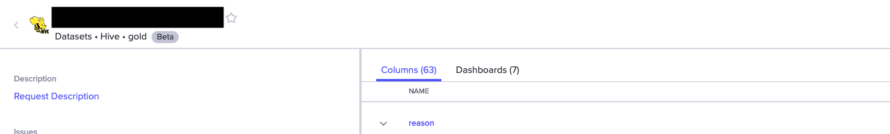
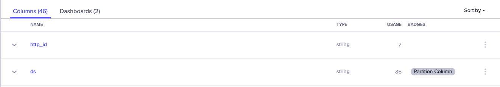

# How to add table level and column level badges
Amundsen supports use of clickable badges on tables, and non clickable badges for columns. Clickable badges trigger a search for all of the resources with the given badge name as a filter.


*Table badge*


*Column badge*
## Badges configuration

In order for amundsen to accept new badges via metadata and to change the style in the UI there are two configs that need to be setup:

On [amundsen metadata library](https://github.com/amundsen-io/amundsen/blob/main/metadata/metadata_service/config.py) you should add your badges to the whitelist within your custom configuration file following the format of this example:

```
# whitelist badges
WHITELIST_BADGES: List[Badge] = [
    Badge(badge_name='alpha',
          category='table_status'),
    Badge(badge_name='beta',
          category='table_status'),
]
```

In order to set up the color and display name on [amundsen frontend library](https://github.com/amundsen-io/amundsen/blob/main/frontend/amundsen_application/static/js/config/config-custom.ts) you should add the desired badges style as follows:

```
const configCustom: AppConfigCustom = {
    badges: {
        'alpha': {
            style: BadgeStyle.DEFAULT,
            displayName: 'Alpha',
        },
        'partition column': {
            style: BadgeStyle.DEFAULT,
            displayName: 'Partition Column',
        },
    }
}
```

**Note:** any badges that are not defined in this configuration will show up with `BadgeStyle.DEFAULT`.


## Adding table badges through metadata library
To manually add a badge to a particular table the metadata API can be used. Here are the available requests:

To add a badge on a table:
```
curl -X PUT https://{your metadata url}/table/{table key}/badge/{badge name}?category={badge category}
```

To delete a badge on a table:
```
curl -X DELETE https://{your metadata url}/table/{table key}/badge/{badge name}?category={badge category}
```

To add a badge on a column:
```
curl -X PUT https://{your metadata url}/table/{table key}/column/{column name}/badge/{badge name}?category={badge category}
```

To delete a badge on a column:
```
curl -X DELETE https://{your metadata url}/table/{table key}/column/{column name}/badge/{badge name}?category={badge category}
```

`table key` is in the format of `datasource://database.schema/table`

## Adding badges throught databuilder (and column level badges)

To add badges using databuilder, you can use the [BadgeMetadata](https://github.com/amundsen-io/amundsen/blob/main/databuilder/databuilder/models/badge.py) class and pass in the entity you want to create a badge relationship for. For an example of how this is done search for badge in [TableMetadata](https://github.com/amundsen-io/amundsen/blob/main/databuilder/databuilder/models/table_metadata.py) to see how we add badge nodes and relationships to neo4j.
In [hive_table_metadata_extractor.py](https://github.com/amundsen-io/amundsen/blob/main/databuilder/databuilder/extractor/hive_table_metadata_extractor.py#L144) you can see how the partition column is obtained and added to a column so the badge node can be created and related to the correct column.
