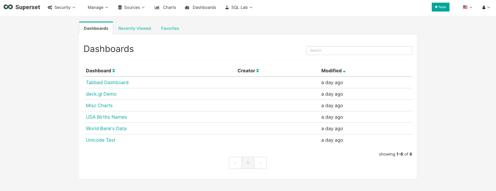
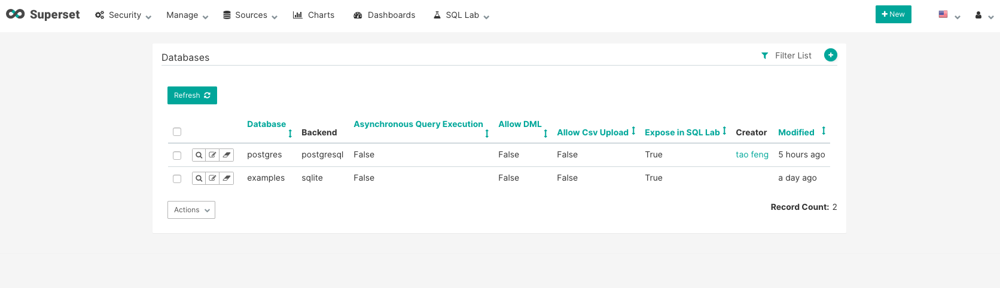
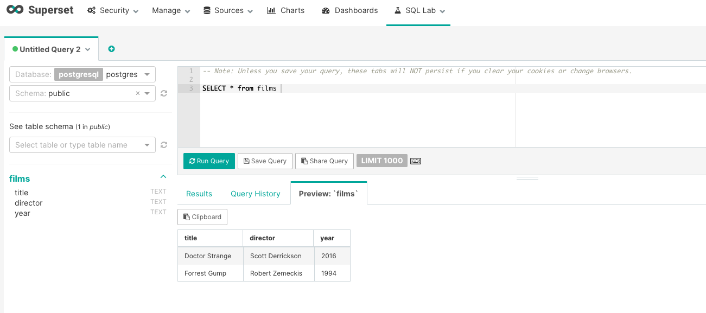
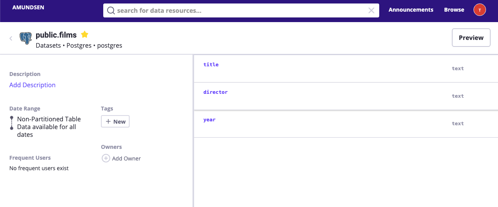
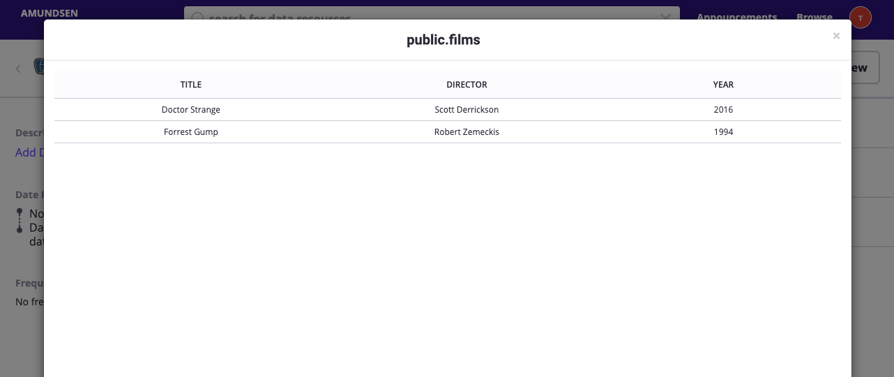

# How to setup a preview client with Apache Superset

In the previous [tutorial](./index-postgres.md), we talked about how to index the table metadata
for a postgres database. In this tutorial, we will walk through how to configure data preview for this `films` table
using Apache Superset.

Amundsen provides an integration between Amundsen and BI Viz tool for data preview. It is not necessary to use Apache Superset
as long as the BI Viz tool provides endpoint to do querying and get the results back from the BI tool.
[Apache Superset](https://superset.apache.org/) is an open-source business intelligence tool
that can be used for data exploration and it is what we leverage internally at Lyft to support the feature.

1. Please setup Apache Superset following its official installation
[guide](https://superset.apache.org/installation.html#superset-installation-and-initialization):
   ```bash
    # Install superset
    pip install apache-superset

    # Initialize the database
    superset db upgrade

    # Create an admin user (you will be prompted to set a username, first and last name before setting a password)
    $ export FLASK_APP=superset
    superset fab create-admin

    # Load some data to play with
    superset load_examples

    # Create default roles and permissions
    superset init

    # To start a development web server on port 8088, use -p to bind to another port
    superset run -p 8088 --with-threads --reload --debugger
   ```

   Once setup properly, you could view the superset UI as following:
   

2. We need to add the postgres database to superset as the following:


3. We could verify the content of the `films` table using superset's sqlab feature:


1. Next, We need to build a preview client following this [guide](https://github.com/amundsen-io/amundsen/blob/main/frontend/docs/examples/superset_preview_client.md)
and the [example client code](https://github.com/amundsen-io/amundsen/blob/main/frontend/amundsen_application/base/examples/example_superset_preview_client.py).
There are a couple of things to keep in mind:
    - We could start with an unauthenticated Superset([example superset config](https://gist.github.com/feng-tao/b89e6faf7236372cef70a44f13615c39)),
    but in production, we will need to send the impersonate info to Superset
    to properly verify whether the given user could view the data.
    - When we build the client, we could need to configure the database id instead of the database name when send the request to superset.

5. Once we configure the preview client, put it in the frontend service entry point ([example](https://github.com/amundsen-io/amundsen/blob/main/frontend/docs/configuration.md#python-entry-points)) and restart the frontend.

6. We could now view the preview data for the `films` table in Amundsen.

From the above figure, the preview button on the table page is clickable.
Once it clicked, you could see the actual data queried
from Apache Superset:

