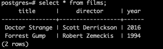
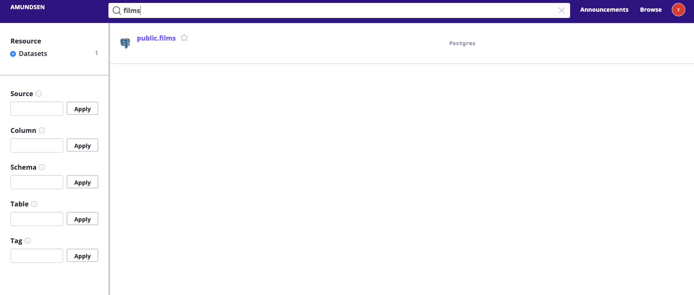
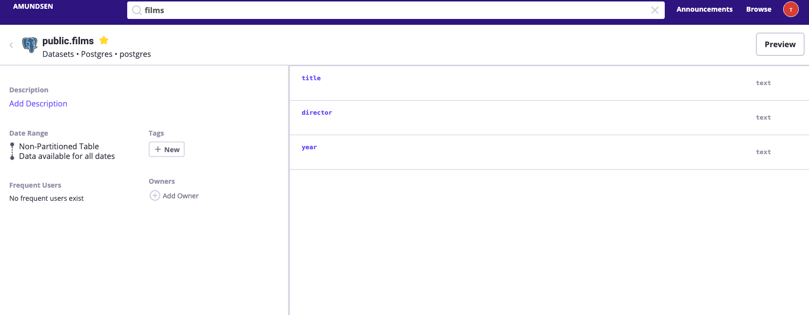

# How to index metadata for real life databases

From previous [doc](../installation.md), we have indexed tables from a csv files. In real production cases, 
the table metadata is stored in data warehouses(e.g Hive, Postgres, Mysql, Snowflake, Bigquery etc.) which Amundsen has 
the extractors for metadata extraction.

In this tutorial, we will use a postgres db as an example to walk through how to index metadata for a postgres database.
The doc won't cover how to setup a postgres database.

1. In the example, we have a postgres table in localhost postgres named `films`.

2. We leverage the [postgres metadata extractor](https://github.com/amundsen-io/amundsendatabuilder/blob/master/databuilder/extractor/postgres_metadata_extractor.py)
to extract the metadata information of the postgres database. We could call the metadata extractor 
in an adhoc python function as this [example](https://github.com/amundsen-io/amundsendatabuilder/pull/248/commits/f5064e58a19a5bfa380b333cfc657ebb34702a2c)
or from an Airflow DAG.

3. Once we run the script, we could search the `films` table using Amundsen Search.

4. We could also find and view the `films` table in the table detail page.

This tutorial uses postgres to serve as an example, but you could apply the same approach for your various data warehouses. If Amundsen 
doesn't provide the extractor, you could build one based on the API and contribute the extractor back to us!
