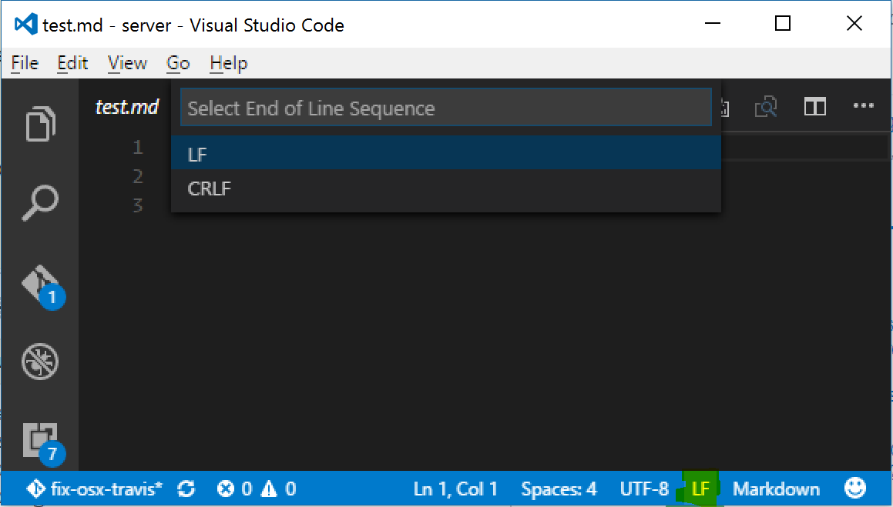

# Windows Troubleshooting

1. Neo4j UI doesn't start

   If Neo4j UI doesn't come up, check `neo4j` container logs. If you see output like below, then change the `End of Line Sequence` setting for `.\example\docker\neo4j\conf\neo4j.conf` file, using `VS Code`.

   ```
   neo4j_amundsen      | Changed password for user 'neo4j'.
   neo4j_amundsen      | Active database: amundsen.db
   neo4j_amundsen      | Directories in use:
   neo4j_amundsen      |   home:         /var/lib/neo4j
   neo4j_amundsen      |   config:       /var/lib/neo4j/conf
   neo4j_amundsen      |   logs:         /var/log/neo4j
   neo4j_amundsen      |   plugins:      /plugins
   neo4j_amundsen      |   import:       /var/lib/neo4j/import
   neo4j_amundsen      |   data:         /neo4j/data
   neo4j_amundsen      |   certificates: /var/lib/neo4j/certificates
   neo4j_amundsen      |   run:          /var/lib/neo4j/run
   neo4j_amundsen      | Starting Neo4j.
   'eo4j_amundsen      | Unrecognized VM option 'UseG1GC
   neo4j_amundsen      | Did you mean '(+/-)UseG1GC'?
   neo4j_amundsen      | Error: Could not create the Java Virtual Machine.
   neo4j_amundsen      | Error: A fatal exception has occurred. Program will exit.
   ```
   **VS Code Note:** Use <kbd>ctrl</kbd><kbd>shift</kbd><kbd>p</kbd> to open `Command Palette`. Choose `LF`. Press `Enter`.

2. Installing [databuilder](https://github.com/amundsen-io/amundsen/tree/main/databuilder) fails due to `extras_require` error:

   ```
   error in amundsen-databuilder setup command: 'extras_require' must be a dictionary whose values are
   strings or lists of strings containing valid project/version requirement specifiers.
   ```
   
   This error results from `databuilder/requirements_dev.txt` containing a symlink to `requirements_dev.txt` which is not properly
   interpreted by Windows, resulting in the path being included as a requirement (which fails to parse as a requirement causing
   the error). To work around this issue on windows, copy the root `requirements_dev.txt` over the file in `databuilder/`. This breaks
   the link between the two files, meaning more work for windows developers to keep them in sync, but the `setup.py` script
   will now function properly.


