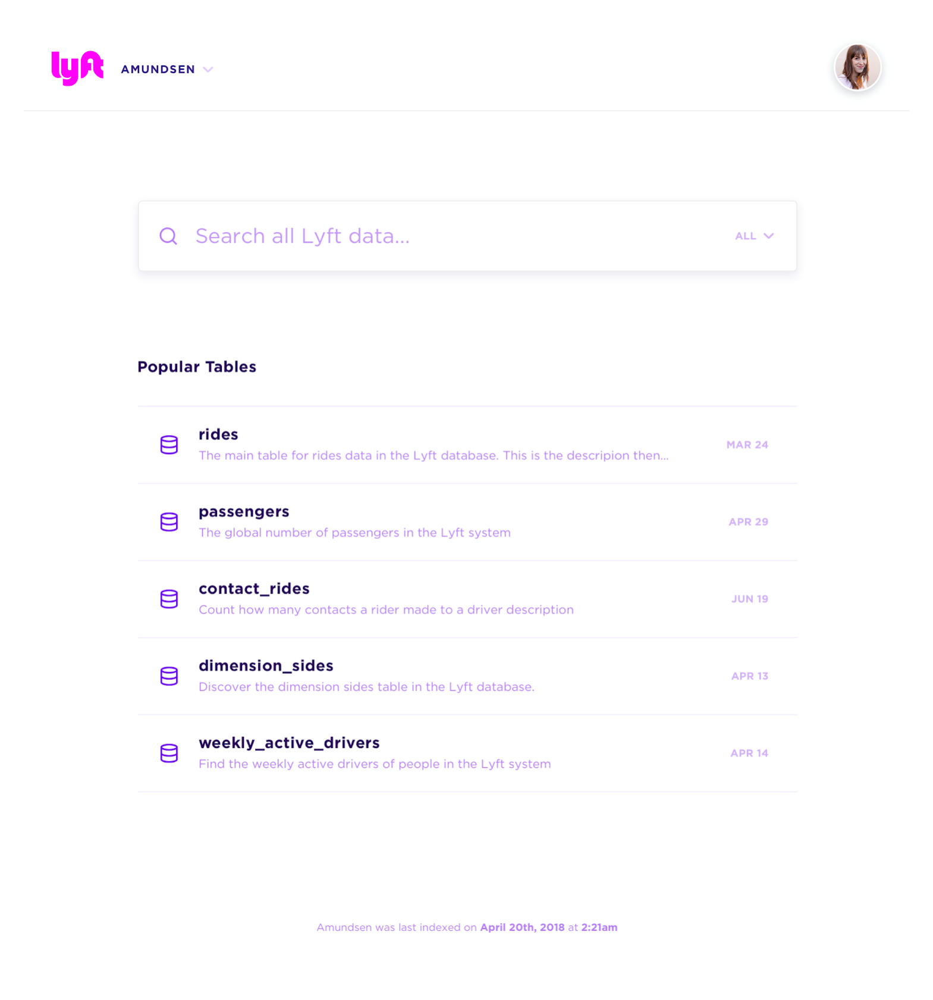
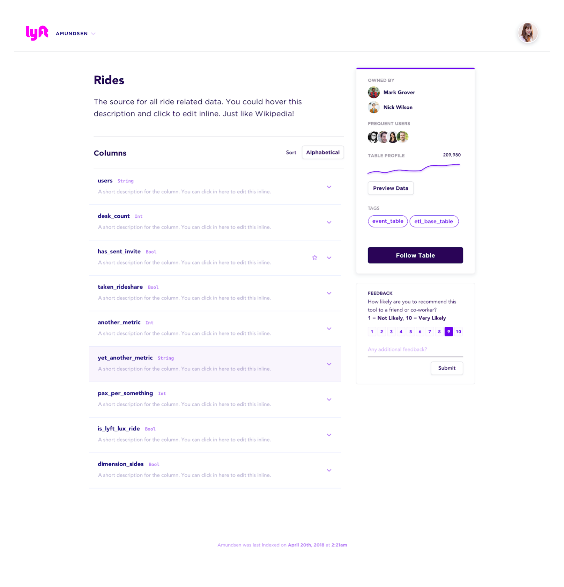
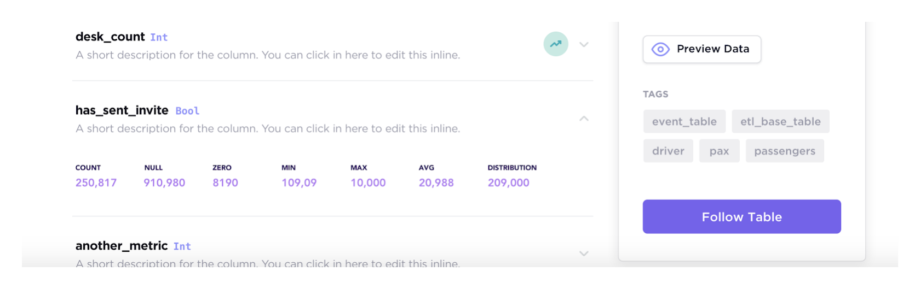
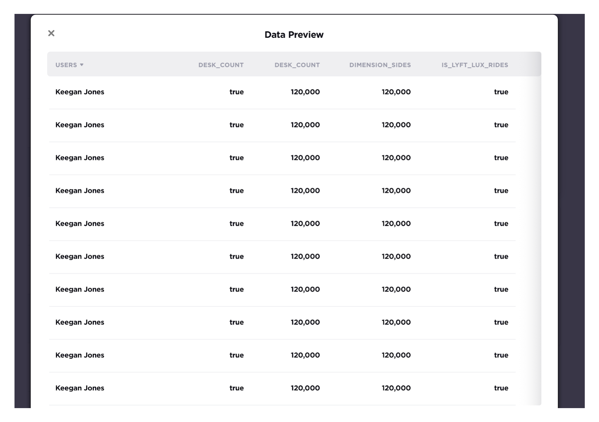

# Amundsen Frontend Service

Amundsen is a metadata driven application for improving the productivity of data analysts, data scientists and engineers when interacting with data. It does that today by indexing data resources (tables, dashboards, streams, etc.) and powering a page-rank style search based on usage patterns (e.g. highly queried tables show up earlier than less queried tables). Think of it as Google search for data. The project is named after Norwegian explorer [Roald Amundsen](https://en.wikipedia.org/wiki/Roald_Amundsen), the first person to discover South Pole.

The frontend service leverages a separate [search service](./../search) for allowing users to search for data resources, and a separate [metadata service](./../metadata) for viewing and editing metadata for a given resource. It is a Flask application with a React frontend.

For information about Amundsen and our other services, refer to this [README.md](./../README.md). Please also see our instructions for a [quick start](./../docs/installation.md#bootstrap-a-default-version-of-amundsen-using-docker) setup  of Amundsen with dummy data, and an [overview of the architecture](./../docs/architecture.md#architecture).

## Requirements
- Python >= 3.6
- Node = v10 or v12 
- npm >= 6.x.x

## Homepage
- https://www.amundsen.io/

## Documentation
- https://www.amundsen.io/amundsen/

## User Interface

Please note that the mock images only served as demonstration purpose.

- **Landing Page**: The landing page for Amundsen including 1. search bars; 2. popular used tables;

    

- **Search Preview**: See inline search results as you type

    
    
- **Table Detail Page**: Visualization of a Hive / Redshift table

    

- **Column detail**: Visualization of columns of a Hive / Redshift table which includes an optional stats display

    

- **Data Preview Page**: Visualization of table data preview which could integrate with [Apache Superset](https://github.com/apache/incubator-superset)

    

## Installation

Please visit [Installation guideline](docs/installation.md) on how to install Amundsen.

## Configuration

Please visit [Configuration doc](docs/configuration.md) on how to configure Amundsen various enviroment settings(local vs production).

## Developer Guidelines

Please visit [Developer guidelines](docs/developer_guide.md) if you want to build Amundsen in your local environment.

# License
[Apache 2.0 License.](/LICENSE)
