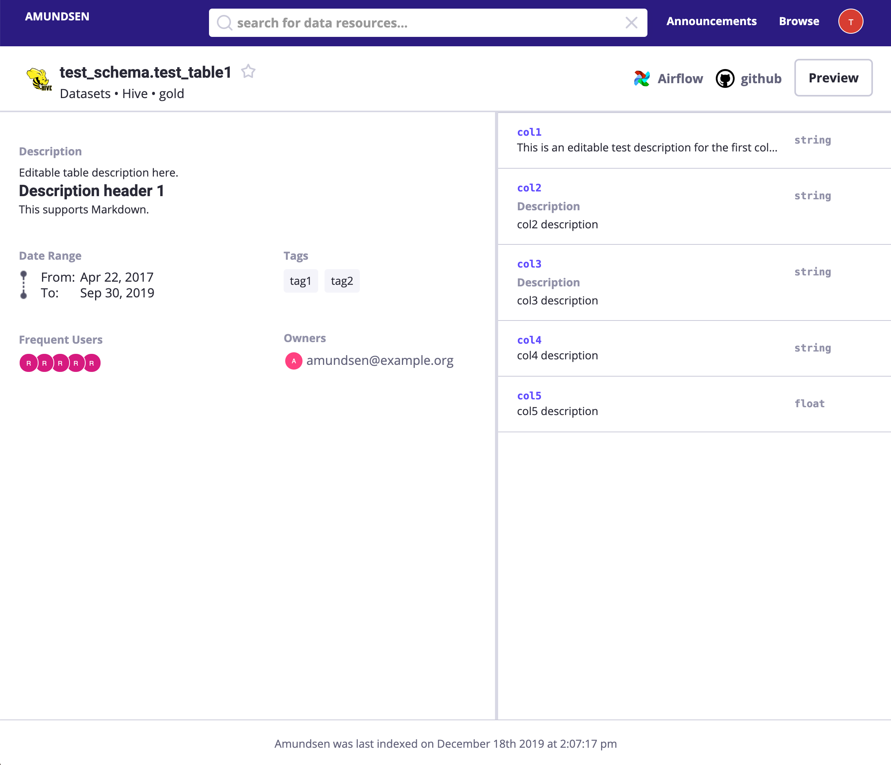

# Amundsen

Amundsen is a data discovery portal to make data more discoverable. The project named after Norwegian explorer [Roald Amundsen](https://en.wikipedia.org/wiki/Roald_Amundsen) collects and displays
metadata about various data resources such as Hive and Redshift tables.

It includes three microservices and a data ingestion library.
- [amundsenfrontendlibrary](https://github.com/lyft/amundsenfrontendlibrary): Frontend service which is a Flask application with a React frontend.
- [amundsensearchsearchlibrary](https://github.com/lyft/amundsensearchlibrary): Search service, which leverages Elasticsearch for search capabilities, is used to power frontend metadata searching.
- [amundsenmetadatalibrary](https://github.com/lyft/amundsenmetadatalibrary): Metadata service, which leverages Neo4j as the persistent layer, to provide various metadata.
- [amundsendatabuilder](https://github.com/lyft/amundsendatabuilder): Data ingestion library for building metadata graph and search index. 
Users could either load the data with [a python script](https://github.com/lyft/amundsendatabuilder/blob/master/example/scripts/sample_data_loader.py) with the library
or with an [Airflow DAG](https://github.com/lyft/amundsendatabuilder/blob/master/example/dags/sample_dag.py) importing the library.

## Requirements
- Python >= 3.4

## User Interface

Please note that the mock images only served as demonstration purpose.

- **Landing Page**: The landing page for Amundsen including 1. search bars; 2. popular used tables;
    
    
    
- **Table Detail Page**: Visualization of a Hive / Redshift table
    
    
    
- **Column detail**: Visualization of columns of a Hive / Redshift table which includes an optional stats display
    
    
    
- **Data Preview Page**: Visualization of table data preview which could integrate with [Apache Superset](https://github.com/apache/incubator-superset)
    
    
    
## Getting started

Please visit the Amundsen documentation for help with [installing Amundsen](https://github.com/lyft/amundsenfrontendlibrary/blob/master/docs/installation.md#install-standalone-application-directly-from-the-source) 
and getting a [quick start](https://github.com/lyft/amundsenfrontendlibrary/blob/master/docs/installation.md#bootstrap-a-default-version-of-amundsen-using-docker) with dummy data 
or an [overview of the architecture](docs/architecture.md).

## Architecture Overview

Please visit [Architecture](docs/architecture.md) for Amundsen architecture overview.

## Installation

Please visit [Installation guideline](docs/installation.md) on how to install Amundsen.

## Configuration

Please visit [Configuration doc](docs/configuration.md) on how to configure Amundsen various enviroment settings(local vs production).

## Developer Guide

Please visit [Developer guideline](docs/developer_guide.md) if you want to build Amundsen in your local environment.

## Roadmap

Please visit [Roadmap](docs/roadmap.md) if you are interested in Amundsen upcoming roadmap items.

## Community

Want help? Join our [slack channel](https://bit.ly/2tFsN1X)

# License
[Apache 2.0 License.](/LICENSE)
