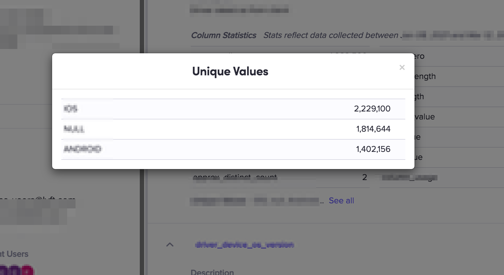
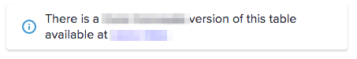
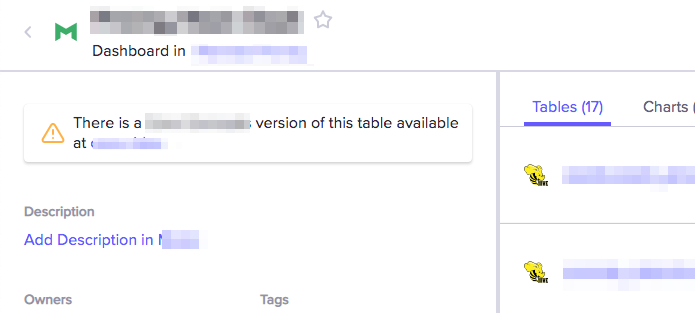
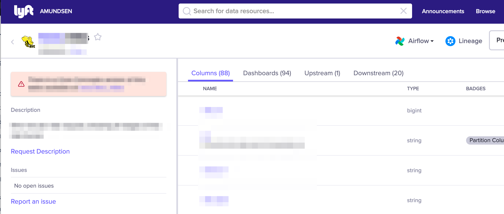

# Application configuration

This document describes how to leverage the frontend service's application configuration to configure particular features. After modifying the `AppConfigCustom` object in [config-custom.ts](https://github.com/amundsen-io/amundsen/blob/main/frontend/amundsen_application/static/js/config/config-custom.ts) in the ways described in this document, be sure to rebuild your application with these changes.

**NOTE: This document is a work in progress and does not include 100% of features. We welcome PRs to complete this document**

## Announcements Config

Annoncements is a feature that allows to disclose new features, changes or any other news to Amundsen's users.

<figure>
  
  <figcaption>Announcements in the homepage</figcaption>
</figure>

To enable this feature, change the `announcements.enable` boolean value by overriding it on [config-custom.ts](https://github.com/amundsen-io/amundsen/blob/main/frontend/amundsen_application/static/js/config/config-custom.ts). Once activated, an "Announcements" link will be available in the global navigation, and a new list of announcements will show up on the right sidebar on the Homepage.

## Badge Config

Badges are a special type of tag that cannot be edited through the UI.

`BadgeConfig` can be used to customize the text and color of badges. This config defines a mapping of badge name to a `BadgeStyle` and optional `displayName`. Badges that are not defined will default to use the `BadgeStyle.default` style and `displayName` use the badge name with any `_` or `-` characters replaced with a space.

## Browse Tags Feature

_TODO: Please add doc_

## Custom Logo

1. Add your logo to the folder in `amundsen_application/static/images/`.
2. Set the the `logoPath` key on the to the location of your image.

## Date

This config allows you to specify various date formats across the app. There are three date formats in use shown below. These correspond to the `formatDate`, `formatDateTimeShort` and `formatDateTimeLong` utility functions.

    default: 'MMM DD, YYYY'
    dateTimeShort: 'MMM DD, YYYY ha z'
    dateTimeLong: 'MMMM Do YYYY [at] h:mm:ss a'

Reference for formatting: https://devhints.io/datetime#momentjs-format

## Analytics

Amundsen supports pluggable user behavior analytics via the [analytics](https://github.com/DavidWells/analytics) library.

To emit analytics to a given destination, you must use one of the provided plugins (open a PR if you need to install a different vendor), then specify it the config passing the configuration of your account. Multiple destinations are supported if you wish to emit to multiple backends simultaneously.

For example, to use Google analytics, you must add the import at the top of your `config-custom.ts` file: `import googleAnalytics from '@analytics/google-analytics';`, then add this config block:

```
analytics: {
  plugins: [
    googleAnalytics({
      trackingId: '<YOUR_UA_CODE>',
      sampleRate: 100
    }),
  ],
}
```

We provide out of the box support for Mixpanel, Segment and Google Analytics. All [`@analytics/` plugins](https://github.com/DavidWells/analytics#analytic-plugins) are potentially supported, but you must first install the plugin: `npm install @analytics/<provider>` and send us a PR with it before you can use it.

## Indexing Optional Resources

In Amundsen, we currently support indexing other optional resources beyond tables.

### Index Users

Users themselves are data resources and user metadata helps to facilitate network based discovery. When users are indexed they will show up in search results, and selecting a user surfaces a profile page that displays that user's relationships with different data resources.

After ingesting user metadata into the search and metadata services, set `IndexUsersConfig.enabled` to `true` on the application configuration to display the UI for the aforementioned features.

### Index Dashboards

Introducing dashboards into Amundsen allows users to discovery data analysis that has been already done. When dashboards are indexed they will show up in search results, and selecting a dashboard surfaces a page where users can explore dashboard metadata.

After ingesting dashboard metadata into the search and metadata services, set `IndexDashboardsConfig.enabled` to `true` on the application configuration to display the UI for the aforementioned features.

## Mail Client Features

Amundsen has two features that leverage the custom mail client -- the feedback tool and notifications.

As these are optional features, our `MailClientFeaturesConfig` can be used to hide/display any UI related to these features:

1. Set `MailClientFeaturesConfig.feedbackEnabled` to `true` in order to display the `Feedback` component in the UI.
2. Set `MailClientFeaturesConfig.notificationsEnabled` to `true` in order to display the optional UI for users to request more information about resources on the `TableDetail` page.

For information about how to configure a custom mail
client, please see this [entry](flask_config.md#mail-client-features) in our flask configuration doc.

## Navigation Links

_TODO: Please add doc_

## Resource Configurations

This configuration drives resource specific aspects of the application's user interface. Each supported resource should be mapped to an object that matches or extends the `BaseResourceConfig`.

### Base Configuration

All resource configurations must match or extend the `BaseResourceConfig`. This configuration supports the following options:

1. `displayName`: The name displayed throughout the application to refer to this resource type.
2. `filterCategories`: An optional `FilterConfig` object. When set for a given resource, that resource will display filter options in the search page UI.
3. `supportedSources`: An optional `SourcesConfig` object.

#### Filter Categories

The `FilterConfig` is an array of objects that match any of the supported filter options. We currently support a `CheckboxFilterCategory` and a `InputFilterCategory`. See our [config-types](https://github.com/amundsen-io/amundsen/blob/main/frontend/amundsen_application/static/js/config/config-types.ts) for more information about each option.

#### Supported Sources

The `SourcesConfig` can be used for the customizations detailed below. See examples in [config-default.ts](https://github.com/amundsen-io/amundsen/blob/main/frontend/amundsen_application/static/js/config/config-default.ts).

##### Custom Icons

You can configure custom icons to be used throughout the UI when representing entities from particular sources. On the `supportedSources` object, add an entry with the `id` used to reference that source and map to an object that specifies the `iconClass` for that database. This `iconClass` should be defined in [icons.scss](https://github.com/amundsen-io/amundsen/blob/main/frontend/amundsen_application/static/css/_icons.scss).

##### Display Names

You can configure a specific display name to be used throughout the UI when representing entities from particular sources. On the `supportedSources` object, add an entry with the `id` used to reference that source and map to an object that specified the `displayName` for that source.

### Table Configuration

To configure Table related features we have created a new resource configuration `TableResourceConfig` which extends `BaseResourceConfig`. In addition to the configurations explained above it also supports `supportedDescriptionSources`.

#### Supported Description Sources

A table resource may have a source of table and column description attached to it. We can customize it by using `supportedDescriptionSources` object which is an optional object.
This object has `displayName` and `iconPath`, which can be used throughout the UI to represent a particular description source. See example in [config-default.ts](https://github.com/amundsen-io/amundsen/blob/main/frontend/amundsen_application/static/js/config/config-default.ts).
For configuring new description sources, add an entry in `supportedDescriptionSources` with the `id` used to reference that source and add desired display name and icon for it.

## Table Stats

If you have a stat field that is made of a JSON like set of value names and counts, you can show that as a set of "unique values". You can see an example of this in the following figure:



To achieve this, you will need to modify your custom configuration (config-custom.ts) by adding the name of the stat_type field that holds these values. You can find the config property in the stats section for table resource:

```
[ResourceType.table]: {
  //...
  stats: {
    uniqueValueTypeName: "keyNameExample",
  },
}
```

The unique values set needs to be an object like this:

```
    {
      end_epoch: 1609522182,
      start_epoch: 1608917382,
      stat_type: 'keyNameExample',
      stat_val:
        "{'Category': 66, 'AnotherCategory': 54, 'More': 48}",
    },
```

## Notices

We now can add notices to tables and dashboards. These notices allows Amundsen administrators to show informational, warning and alert messages related to the different resources (tables, dashboards, eventually people) we expose in Amundsen.

This feature help administrators show messages related to deprecation, updates (or lack of), and informational messages related to specific resources.

A notice is a small box with an icon and a message containing HTML markup (like links and bolded text). These will come in three flavors:

<figure>
  <figcaption>Informational: Marked with a blue "i" icon on the right side</figcaption>
  
</figure>

<figure>
  <figcaption>Warning: Marked with an orange exclamation mark icon on the right side</figcaption>
  
</figure>

<figure>
  <figcaption>Alert: Marked with a red exclamation mark icon on the right side</figcaption>
  
</figure>

To set them up, we'll use the current configuration objects for the resources. In the event that we want to add the same notice to every table that follows a particular pattern, we use a wildcard character, \*, for pattern matching. In addition, we can have dynamic HTML messages to allow for notices to change their message based on what table it is.

For example, if company X wants to deprecate the use of one table or dashboard, they can opt to add new notices in their configuration file:

```
  resourceConfig: {
    [ResourceType.table]: {
      ... //Table Resource Configuration
      notices: {
          "<CLUSTER>.<DATABASE>.<SCHEMA>.<TABLENAME>": {
            severity: NoticeSeverity.ALERT,
            messageHtml: `This table is deprecated, please use <a href="<LINKTONEWTABLEDETAILPAGE>">this new table</a> instead.`,
          },
      },
    },
    [ResourceType.dashboard]: {
      ... //Dashboard Resource Configuration
      notices: {
          "<PRODUCT>.<CLUSTER>.<GROUPNAME>.<DASHBOARDNAME>": {
            severity: NoticeSeverity.WARNING,
            messageHtml: `This dashboard is deprecated, please use <a href="<LINKTONEWDASHBOARDDETAILPAGE>">this new dashboard</a> instead.`,
          },
      },
    },

  },
```

The above code will show a notice with a red exclamation icon whenever a final user visits the table's Table Detail page or the Dashboard Detail page.

If you want to target several tables at once, you can use wildcards as shown below:

```
  resourceConfig: {
    [ResourceType.table]: {
      ... //Table Resource Configuration
      notices: {
          "<CLUSTER>.<DATABASE>.<SCHEMA>.*": {
            severity: NoticeSeverity.ALERT,
            messageHtml: `This table is deprecated`,
          },
      },
    },
    [ResourceType.dashboard]: {
      ... //Dashboard Resource Configuration
      notices: {
          "<PRODUCT>.<CLUSTER>.<GROUPNAME>.*": {
            severity: NoticeSeverity.WARNING,
            messageHtml: `This dashboard is deprecated`,
          },
      },
    },

  },
```

The above code will show a notice with a red exclamation icon whenever a final user visits any table within the specified cluster, database, and schema or any dashboard within the specified product, cluster, and groupname.

Wildcards can also replace individual parts of table names. If you want to add a notice to all resources whose names followed the pattern foo\_\*:

```
  resourceConfig: {
    [ResourceType.table]: {
      ... //Table Resource Configuration
      notices: {
          "<CLUSTER>.<DATABASE>.<SCHEMA>.foo_*": {
            severity: NoticeSeverity.INFO,
            messageHtml: `This table has information`,
          },
      },
    },
    [ResourceType.dashboard]: {
      ... //Dashboard Resource Configuration
      notices: {
          "<PRODUCT>.<CLUSTER>.<GROUPNAME>.foo_*": {
            severity: NoticeSeverity.INFO,
            messageHtml: `This dashboard has information`,
          },
      },
    },

  },
```

The above code will show the message on any table with the specified cluster, database and schema whose table name starts with `foo_` or any dashboard with the specified product, cluster, and groupname whose dashboard name starts with `foo_`.

If you want to use a dynamic HTML message that changes depending on the name of the resource, you can use string formatting as shown below:

```
  resourceConfig: {
    [ResourceType.table]: {
      ... //Table Resource Configuration
      notices: {
          "<CLUSTER>.<DATABASE>.<SCHEMA>.*": {
            severity: NoticeSeverity.ALERT,
            messageHtml: (resourceName) => {
              const [cluster, datasource, schema, table] = resourceName.split('.');
              return `This schema is deprecated, please use <a href="https://amundsen.<company>.net/table_detail/${cluster}/${datasource}/SCHEMA/${table}">this table instead</a>`;
            },
          },
      },
    },
    [ResourceType.dashboard]: {
      ... //Dashboard Resource Configuration
      notices: {
          "<PRODUCT>.<CLUSTER>.<GROUPNAME>.*": {
            severity: NoticeSeverity.WARNING,
            messageHtml: (resourceName) => {
              const [product, cluster, groupname, dashboard] = resourceName.split('.');
              return `${groupname} is deprecated, please use <a href="LINKTODASHBOARD">this dashboard instead</a>`;
            },
          },
      },
    },

  },
```

The above code will show a notice with a dynamic message and a red exclamation icon whenever a final user visits any table within the specified cluster, database, and schema or any dashboard within the specified product, cluster, and groupname. We can also use dynamic messages for notices without the wildcard by replacing the \* with the specific table or dashboard name.

This feature's ultimate goal is to allow Amundsen administrators to point their users to more trusted/higher quality resources without removing the old references.

Learn more about the future developments for this feature in [its RFC](https://github.com/amundsen-io/rfcs/blob/master/rfcs/029-resource-notices.md).

## Table Lineage

_TODO: Please add doc_

## Table Profile

_TODO: Please add doc\*_

## Issue Tracking Features

In order to enable Issue Tracking, set `IssueTrackingConfig.enabled` to `true` to see UI features. Further configuration is required to fully enable the feature, please see this [entry](flask_config.md#issue-tracking-integration-features).

To prepopulate the issue description text field with a template to suggest more detailed information to be provided by the user when an issue is reported, set `IssueTrackingConfig.issueDescriptionTemplate` with the desired string.

A default project ID to specify where issues will be created is set in the flask configuration, but to allow users to override this value and choose which project their issue is created in, set `IssueTrackingConfig.projectSelection.enabled`
to `true`. This will add an extra input field in the `Report an issue` modal that will accept a Jira project key, but if no input is entered, it will use the value that is set in the flask configuration. This feature is currently only
implemented for use with Jira issue tracking.

- Set `IssueTrackingConfig.projectSelection.title` to add a title to the input field, for example `Jira project key (optional)`, to let users know what to enter in the text field.
- An optional config `IssueTrackingConfig.projectSelection.inputHint` can be set to show a hint in the input field, which can be helpful to show users an example that conveys the expected format of the project key.

## Product Tour feature

The Product Tour for Amundsen is a UI based walkthrough configurable component that helps onboard users into Amundsen. Alternatively, it helps us promote new features added to Amundsen, and educate our users about its use.

The Tour triggers in two different modes. The first is a general "Getting started with Amundsen" walkthough, while the second highlights different features. Both would be formed by an overlay and a modal that is attached to elements in the UI.

This modal window has a "Dimiss" button that would hide the Tour altogether; a "Back" button that would move the user to the previous tour step, a "Next" button that moves it forward and a "Close" button with the usual "X" shape in the top right corner.

For Amundsen maintainers, we extend the JavaScript configuration file with a block about the tour. This object has a shape like this:

```JS
...
productTour: {
  '/': [
    {
      isFeatureTour: false,
      isShownOnFirstVisit: true,
      isShownProgrammatically: true,
      steps: [
        {
          target: '.nav-bar-left a',
          title: 'Welcome to Amundsen',
          content:
            'Hi!, welcome to Amundsen, your data discovery and catalog product!',
        },
        {
          target: '.search-bar-form .search-bar-input',
          title: 'Search for resources',
          content:
            'Here you will search for the resources you are looking for',
        },
        {
          target: '.bookmark-list-header',
          title: 'Save your bookmarks',
          content:
            'Here you will see a list of the resources you have bookmarked',
        },
      ],
    },
  ],
},
```

Where:

- isFeatureTour - tells if the tour is for a whole page (false) or just for one feature within the page.
- isShownOnFirstVisit - whether the users will see the tour on their first visit.
- isShownProgrammatically - whether we want to add the button to trigger the tour to the global navigation
