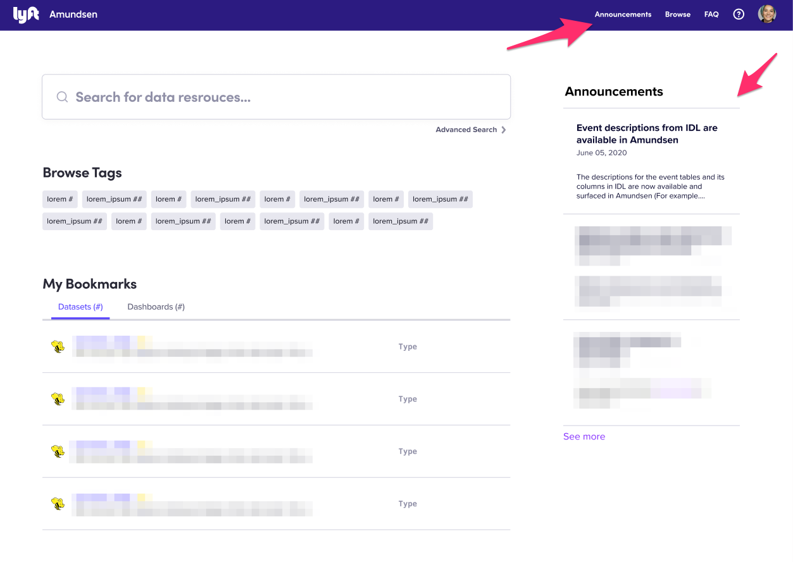

# Application configuration

This document describes how to leverage the frontend service's application configuration to configure particular features. After modifying the `AppConfigCustom` object in [config-custom.ts](https://github.com/lyft/amundsenfrontendlibrary/blob/master/amundsen_application/static/js/config/config-custom.ts) in the ways described in this document, be sure to rebuild your application with these changes.

**NOTE: This document is a work in progress and does not include 100% of features. We welcome PRs to complete this document**

## Announcements Config

Annoncements is a feature that allows to disclose new features, changes or any other news to Amundsen's users.



To enable this feature, change the `announcements.enable` boolean value by overriding it on [config-custom.ts](https://github.com/amundsen-io/amundsenfrontendlibrary/blob/master/amundsen_application/static/js/config/config-custom.ts#L1). Once activated, an "Announcements" link will be available in the global navigation, and a new list of announcements will show up on the right sidebar on the Homepage.

## Badge Config

Badges are a special type of tag that cannot be edited through the UI.

`BadgeConfig` can be used to customize the text and color of badges. This config defines a mapping of badge name to a `BadgeStyle` and optional `displayName`. Badges that are not defined will default to use the `BadgeStyle.default` style and `displayName` use the badge name with any `_` or `-` characters replaced with a space.

## Browse Tags Feature

_TODO: Please add doc_

## Custom Logo

1. Add your logo to the folder in `amundsen_application/static/images/`.
2. Set the the `logoPath` key on the to the location of your image.

## Date

This config allows you to specify various date formats across the app. There are three date formats in use shown below. These correspond to the `formatDate`, `formatDateTimeShort` and `formatDateTimeLong` utility functions.

    default: 'MMM DD, YYYY'
    dateTimeShort: 'MMM DD, YYYY ha z'
    dateTimeLong: 'MMMM Do YYYY [at] h:mm:ss a'

Reference for formatting: https://devhints.io/datetime#momentjs-format

## Analytics

Amundsen supports pluggable user behavior analytics via the [analytics](https://github.com/DavidWells/analytics) library.

To emit analytics to a given destination, you must use one of the provided plugins (open a PR if you need to install a different vendor), then specify it the config passing the configuration of your account. Multiple destinations are supported if you wish to emit to multiple backends simultaneously.

For example, to use Google analytics, you must add the import at the top of your `config-custom.ts` file: `import googleAnalytics from '@analytics/google-analytics';`, then add this config block:

```
analytics: {
  plugins: [
    googleAnalytics({
      trackingId: '<YOUR_UA_CODE>',
      sampleRate: 100
    }),
  ],
}
```

We provide out of the box support for Mixpanel, Segment and Google Analytics. All [`@analytics/` plugins](https://github.com/DavidWells/analytics#analytic-plugins) are potentially supported, but you must first install the plugin: `npm install @analytics/<provider>` and send us a PR with it before you can use it.

## Indexing Optional Resources

In Amundsen, we currently support indexing other optional resources beyond tables.

### Index Users

Users themselves are data resources and user metadata helps to facilitate network based discovery. When users are indexed they will show up in search results, and selecting a user surfaces a profile page that displays that user's relationships with different data resources.

After ingesting user metadata into the search and metadata services, set `IndexUsersConfig.enabled` to `true` on the application configuration to display the UI for the aforementioned features.

### Index Dashboards

Introducing dashboards into Amundsen allows users to discovery data analysis that has been already done. When dashboards are indexed they will show up in search results, and selecting a dashboard surfaces a page where users can explore dashboard metadata.

After ingesting dashboard metadata into the search and metadata services, set `IndexDashboardsConfig.enabled` to `true` on the application configuration to display the UI for the aforementioned features.

## Mail Client Features

Amundsen has two features that leverage the custom mail client -- the feedback tool and notifications.

As these are optional features, our `MailClientFeaturesConfig` can be used to hide/display any UI related to these features:

1. Set `MailClientFeaturesConfig.feedbackEnabled` to `true` in order to display the `Feedback` component in the UI.
2. Set `MailClientFeaturesConfig.notificationsEnabled` to `true` in order to display the optional UI for users to request more information about resources on the `TableDetail` page.

For information about how to configure a custom mail
client, please see this [entry](flask_config.md#mail-client-features) in our flask configuration doc.

## Navigation Links

_TODO: Please add doc_

## Resource Configurations

This configuration drives resource specific aspects of the application's user interface. Each supported resource should be mapped to an object that matches or extends the `BaseResourceConfig`.

### Base Configuration

All resource configurations must match or extend the `BaseResourceConfig`. This configuration supports the following options:

1. `displayName`: The name displayed throughout the application to refer to this resource type.
2. `filterCategories`: An optional `FilterConfig` object. When set for a given resource, that resource will display filter options in the search page UI.
3. `supportedSources`: An optional `SourcesConfig` object.

#### Filter Categories

The `FilterConfig` is an array of objects that match any of the supported filter options. We currently support a `MultiSelectFilterCategory` and a `SingleFilterCategory`. See our [config-types](https://github.com/lyft/amundsenfrontendlibrary/blob/master/amundsen_application/static/js/config/config-types.ts) for more information about each option.

#### Supported Sources

The `SourcesConfig` can be used for the customizations detailed below. See examples in [config-default.ts](https://github.com/lyft/amundsenfrontendlibrary/blob/master/amundsen_application/static/js/config/config-default.ts).

##### Custom Icons

You can configure custom icons to be used throughout the UI when representing entities from particular sources. On the `supportedSources` object, add an entry with the `id` used to reference that source and map to an object that specifies the `iconClass` for that database. This `iconClass` should be defined in [icons.scss](https://github.com/lyft/amundsenfrontendlibrary/blob/master/amundsen_application/static/css/_icons.scss).

##### Display Names

You can configure a specific display name to be used throughout the UI when representing entities from particular sources. On the `supportedSources` object, add an entry with the `id` used to reference that source and map to an object that specified the `displayName` for that source.

### Table Configuration

To configure Table related features we have created a new resource configuration `TableResourceConfig` which extends `BaseResourceConfig`. In addition to the configurations explained above it also supports `supportedDescriptionSources`.

#### Supported Description Sources

A table resource may have a source of table and column description attached to it. We can customize it by using `supportedDescriptionSources` object which is an optional object.
This object has `displayName` and `iconPath`, which can be used throughout the UI to represent a particular description source. See example in [config-default.ts](https://github.com/lyft/amundsenfrontendlibrary/blob/master/amundsen_application/static/js/config/config-default.ts).
For configuring new description sources, add an entry in `supportedDescriptionSources` with the `id` used to reference that source and add desired display name and icon for it.

## Table Lineage

_TODO: Please add doc_

## Table Profile

_TODO: Please add doc\*_

## Issue Tracking Features

In order to enable Issue Tracking set `IssueTrackingConfig.enabled` to `true` to see UI features. Further configuration
is required to fully enable the feature, please see this [entry](flask_config.md#issue-tracking-integration-features)
