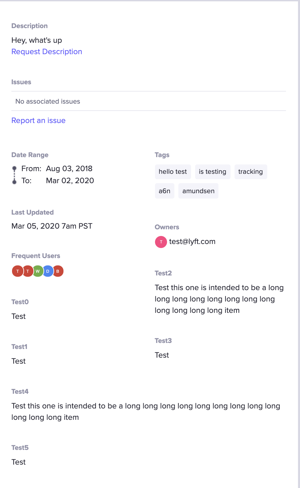

# Flask configuration

After modifying any variable in [config.py](https://github.com/lyft/amundsenfrontendlibrary/blob/master/amundsen_application/config.py) described in this document, be sure to rebuild your application with these changes.

**NOTE: This document is a work in progress and does not include 100% of features. We welcome PRs to complete this document**

## Custom Routes
In order to add any custom Flask endpoints to Amundsen's frontend application, configure a function on the `INIT_CUSTOM_ROUTES` variable. This function takes the created Flask application and can leverage Flask's [add_url_rule](https://flask.palletsprojects.com/en/1.1.x/api/#flask.Flask.add_url_rule) method to add custom routes.

Example: Setting `INIT_CUSTOM_ROUTES` to the `init_custom_routes` method below will expose a `/custom_route` endpoint on the frontend application.
```bash
def init_custom_routes(app: Flask) -> None:
  app.add_url_rule('/custom_route', 'custom_route', custom_route)

def custom_route():
  pass
```

## Mail Client Features
Amundsen has two features that leverage the custom mail client -- the feedback tool and notifications. For these features a custom implementation of [base_mail_client](https://github.com/lyft/amundsenfrontendlibrary/blob/master/amundsen_application/base/base_mail_client.py) must be mapped to the `MAIL_CLIENT` configuration variable.

To fully enable these features in the UI, the application configuration variables for these features must also be set to true. Please see this [entry](application_config.md#mail-client-features) in our application configuration doc for further information.

## Issue Tracking Integration Features
Amundsen has a feature to allow display of associated tickets within the table detail view. The feature both displays 
open tickets and allows users to report new tickets associated with the table. These tickets must contain the 
`table_uri` within the ticket text in order to be displayed; the `table_uri` is automatically added to tickets created 
via the feature. Tickets are displayed from most recent to oldest, and currently only open tickets are displayed. Currently only
 [JIRA](https://www.atlassian.com/software/jira) is supported. The UI must also be enabled to use this feature, please 
 see configuration notes [here](application_config.md#issue-tracking-features). 

There are several configuration 
settings in `config.py` that should be set in order to use this feature. 

Here are the settings and what they should be set to
```python
    ISSUE_TRACKER_URL = None  # type: str (Your JIRA environment, IE 'https://jira.net') 
    ISSUE_TRACKER_USER = None  # type: str (Recommended to be a service account)
    ISSUE_TRACKER_PASSWORD = None  # type: str 
    ISSUE_TRACKER_PROJECT_ID = None  # type: int (Project ID for the project you would like JIRA tickets to be created in) 
    ISSUE_TRACKER_CLIENT = None  # type: str (Fully qualified class name and path) 
    ISSUE_TRACKER_CLIENT_ENABLED = False  # type: bool (Enabling the feature, must be set to True) 
    ISSUE_TRACKER_MAX_RESULTS = None  # type: int (Max issues to display at a time)

```

## Programmatic Descriptions
Amundsen supports configuring other mark down supported non-editable description boxes on the table page.
This can be useful if you have multiple writers which want to write different pieces of information to amundsen
that are either very company specific and thus would never be directly integrated into amundsen or require long form text
to properly convey the information.

What are some more specific examples of what could be used for this?
- You have an existing process that generates quality reports for a dataset that you want to embed in the table page.
- You have a process that detects pii information (also adding the appropriate tag/badge) but also generates a simple
report to provide context.
- You have extended table information that is applicable to your datastore which you want to scrape and provide in the
table page

Programmatic Descriptions are referred to by a "description source" which is a unique identifier.
You can then configure the descriptions to have a custom order in the config.py file like so:
```    
PROGRAMMATIC_DISPLAY = {
           "s3_crawler": {
               "display_order": 0
           },
           "quality_service": {
               "display_order": 1
           },
           "doesnt_exist": {
               "display_order": 2
           }
       }
```
description sources not mentioned in the configuration will be alphabetically placed at the end of the above list. If `PROGRAMMATIC_DISPLAY` is left at `None` all added fields are still showing up, so that display is entirely dynamically data-driven without configuration. Meaning configuration merely adds the (nice) benefit of setting display order.

Here is a screenshot of what it would look like in the bottom left here:

